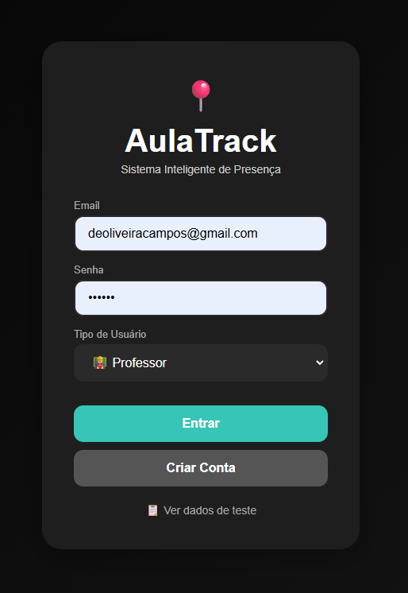
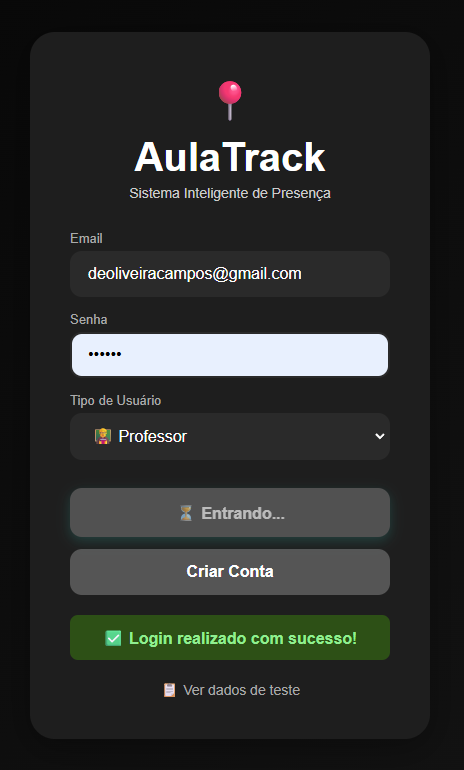
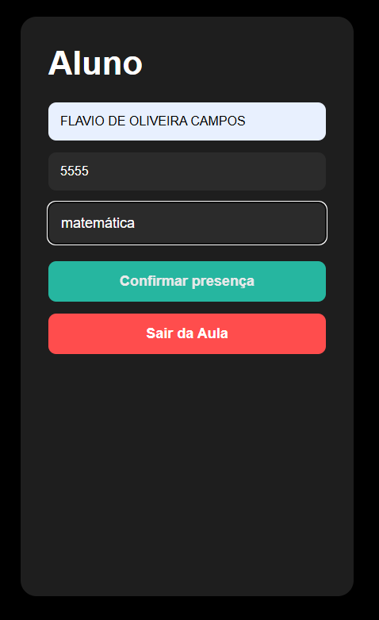
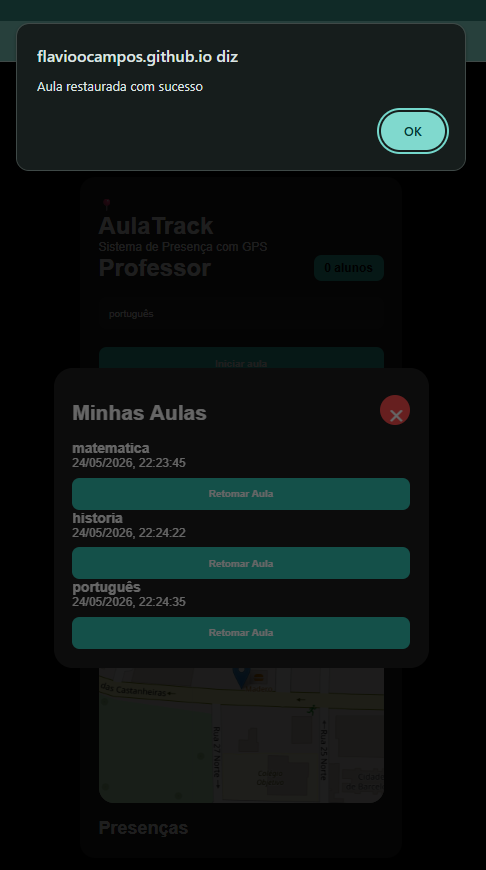
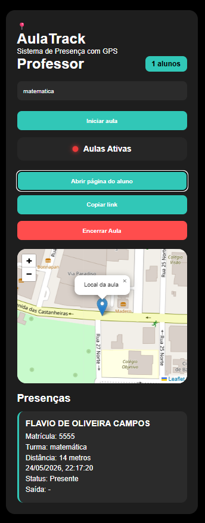

# 📍 AulaTrack - Sistema Inteligente de Presença com GPS

## 📚 Desafio Escolhido

O projeto AulaTrack foi desenvolvido com o objetivo de modernizar o controle de presença em salas de aula utilizando recursos de geolocalização, autenticação e banco de dados em tempo real.

A solução permite que professores criem aulas ativas e que alunos registrem presença apenas estando próximos ao local definido pelo professor, aumentando a segurança e reduzindo fraudes no controle de frequência.

---

# 🚀 Protótipo

## Funcionalidades Implementadas

### 👨‍🏫 Professor
- Login de professor
- Criação de aulas
- Geração automática de código da aula
- Compartilhamento do link da aula
- Visualização de alunos presentes
- Encerramento de aulas
- Retomada de aulas ativas
- Gerenciamento de aulas em tempo real

### 👨‍🎓 Aluno
- Login de aluno
- Entrada na aula via código
- Verificação de localização GPS
- Registro automático de presença
- Atualização em tempo real

### 🌎 Recursos Técnicos
- Firebase Authentication
- Firebase Firestore
- Geolocalização via navegador
- Atualização em tempo real com `onSnapshot`
- Interface responsiva
- Deploy via GitHub Pages

---

# 🖼️ Prints do Sistema

## Tela de Login


## Painel do Professor


## Painel do Aluno


## Minhas Aulas


## Registro de Presença


---

# 🛠️ Plataforma Utilizada

## Tecnologias Utilizadas

- HTML5
- CSS3
- JavaScript
- Firebase Authentication
- Firebase Firestore
- GitHub Pages

---

# ✅ Vantagens Identificadas

1. Desenvolvimento rápido do protótipo.
2. Integração simples com banco de dados em tempo real.
3. Atualização instantânea das informações.
4. Facilidade de hospedagem utilizando GitHub Pages.
5. Redução de fraudes no registro de presença usando GPS.
6. Interface intuitiva e responsiva.
7. Possibilidade de expansão futura para aplicações reais.

---

# ⚠️ Limitações Encontradas

1. Dependência de conexão com internet.
2. Dependência dos serviços Firebase.
3. Limitações da geolocalização em alguns dispositivos.
4. Possíveis restrições de uso em planos gratuitos do Firebase.
5. Necessidade de permissões de localização no navegador.

---

# 🧠 Reflexão Crítica

O desenvolvimento do AulaTrack demonstrou como plataformas e serviços de desenvolvimento rápido podem acelerar significativamente a criação de soluções funcionais.

O uso do Firebase possibilitou implementar autenticação, banco de dados em tempo real e sincronização entre usuários sem necessidade de infraestrutura própria.

Entretanto, o grupo identificou limitações relacionadas à dependência de serviços externos, limitações de customização avançada e necessidade constante de conexão com internet.

Como solução, foram utilizadas integrações manuais em JavaScript e organização modular do sistema para facilitar futuras expansões e migração para arquiteturas mais robustas.

---

# 👥 Colaboração

O projeto foi dividido entre as seguintes atividades:

- Desenvolvimento Front-End
- Integração Firebase
- Sistema de Geolocalização
- Documentação e organização do GitHub
- Testes e validações

A colaboração ocorreu através de compartilhamento do repositório GitHub e reuniões para validação das funcionalidades.

---

# 📅 Registro da Aula

- Data: 11/05/2026
- Atividade: Desenvolvimento do mini-projeto de aplicação
- Local: Laboratório de Informática
- Professora: Kadidja Valéria

---

# 🔮 Próximos Passos

## Melhorias Futuras

- Painel administrativo avançado
- Dashboard com métricas
- Histórico completo de presenças
- Integração com QR Code
- Sistema de notificações
- Aplicativo mobile
- Integração com Inteligência Artificial
- Migração para backend próprio

---

# 🌐 Link do Projeto

https://SEU-USUARIO.github.io/SEU-REPOSITORIO/

---

# 📁 Estrutura do Projeto

```bash
ProjetoModulo3/
│
├── README.md
│
├── docs/
│   ├── login.png
│   ├── professor.png
│   ├── aluno.png
│   ├── minhas_aulas.png
│   └── presencas.png
│
├── unidade_3/
│   ├── professor.html
│   ├── aluno.html
│   ├── style.css
│   └── script.js
```
